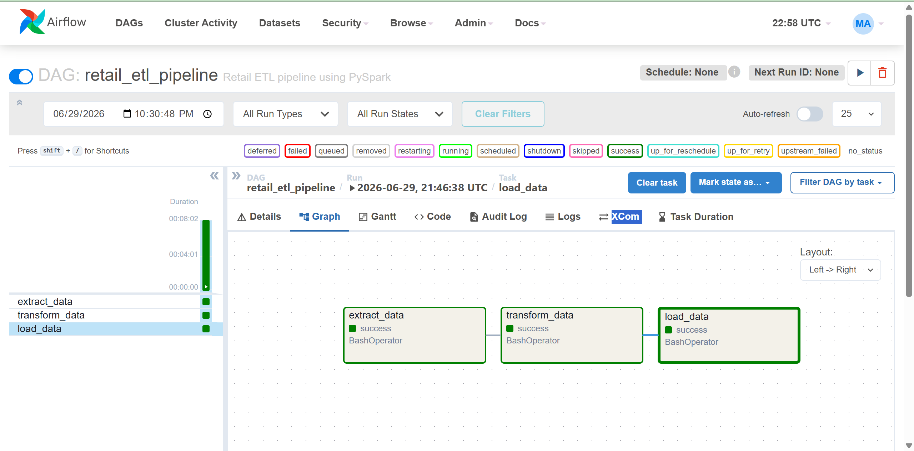
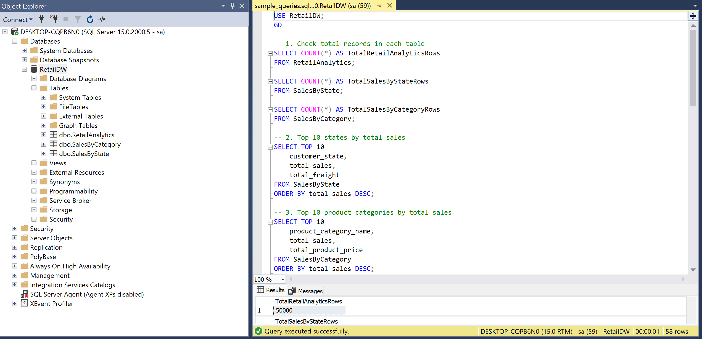
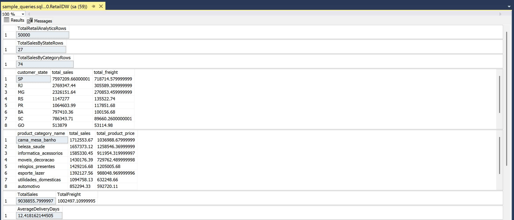

# PySpark Airflow ETL Project

An End-to-End ETL (Extract, Transform, Load) pipeline developed as part of the **Digital Egypt Pioneers Initiative (DEPI)** under the **Microsoft Data Engineering Track**.

The project demonstrates how to build a modern data engineering pipeline using **PySpark**, **Apache Airflow**, **Docker**, and **SQL Server**. The pipeline extracts raw e-commerce data, transforms it into meaningful business insights, and loads the processed data into a SQL Server data warehouse.

---

# Project Overview

This project follows the ETL process:

- **Extract** data from multiple CSV files.
- **Transform** data using PySpark.
- **Load** the processed data into SQL Server.
- **Automate** the workflow using Apache Airflow.
- **Containerize** the environment using Docker.

The project is designed to simulate a real-world data engineering workflow.

---

# Technologies Used

- Python
- PySpark
- Apache Airflow
- Docker
- SQL Server
- Pandas
- PyODBC

---

# Key Features

- End-to-End ETL Pipeline
- Data Cleaning and Transformation
- Apache Airflow Workflow Orchestration
- Dockerized Environment
- SQL Server Data Warehouse
- Business Analytics
- Modular Project Structure

---

# Project Structure

```
pyspark-airflow-etl-project
│
├── dags/
├── data/
├── logs/
├── output/
├── screenshots/
├── scripts/
│   ├── extract.py
│   ├── transform.py
│   └── load.py
│
├── sql/
│   └── sample_queries.sql
│
├── Dockerfile
├── Dockerfile.airflow
├── docker-compose.yml
├── docker-compose-airflow.yml
├── requirements.txt
└── README.md
```

---

# ETL Workflow

## Extract

The pipeline reads multiple CSV datasets from the Olist Brazilian E-commerce Dataset.

## Transform

Using PySpark, the pipeline performs:

- Data Cleaning
- Missing Value Handling
- Dataset Joins
- Sales Aggregation
- Sales by Category
- Sales by State

## Load

The transformed data is loaded into SQL Server tables for further analysis.

---

# Project Architecture

```
                CSV Files
                    │
                    ▼
           Extract (PySpark)
                    │
                    ▼
          Transform (PySpark)
                    │
                    ▼
          Load (SQL Server)
                    │
                    ▼
         Business Analytics
                    │
                    ▼
          Apache Airflow DAG
```

---

# Output

The pipeline generates the following analytical outputs:

- Retail Analytics
- Sales by Category
- Sales by State

These outputs are stored inside the **output** directory and loaded into SQL Server.

---

# Screenshots

## Airflow DAG

The ETL pipeline executed successfully using Apache Airflow.



---

## SQL Server Tables

The transformed data was successfully loaded into SQL Server.



---

## SQL Query Results

Sample analytical queries executed on the generated data warehouse.



---

# How to Run

## Clone the repository

```bash
git clone https://github.com/marwanahmed94/pyspark-airflow-etl-project.git
```

---

## Install dependencies

```bash
pip install -r requirements.txt
```

---

## Run the ETL Pipeline

```bash
python scripts/extract.py
python scripts/transform.py
python scripts/load.py
```

---

## Run Apache Airflow

```bash
docker-compose -f docker-compose-airflow.yml up
```

Open Airflow:

```
http://localhost:8080
```

---

## Run Docker Environment

```bash
docker-compose up --build
```

---

# Dataset

The project uses the **Brazilian E-commerce Public Dataset by Olist**, which contains customer, seller, product, payment, and order information for building analytical reports.

---

# Future Improvements

- Implement incremental data loading.
- Deploy the pipeline to the cloud.
- Add automated testing.
- Integrate Spark Cluster.
- Build real-time streaming pipelines.

---

# Author

**Marwan Ahmed**

Business Information Systems (BIS)

This project was developed as part of the **Digital Egypt Pioneers Initiative (DEPI)** under the **Microsoft Data Engineering Track**.